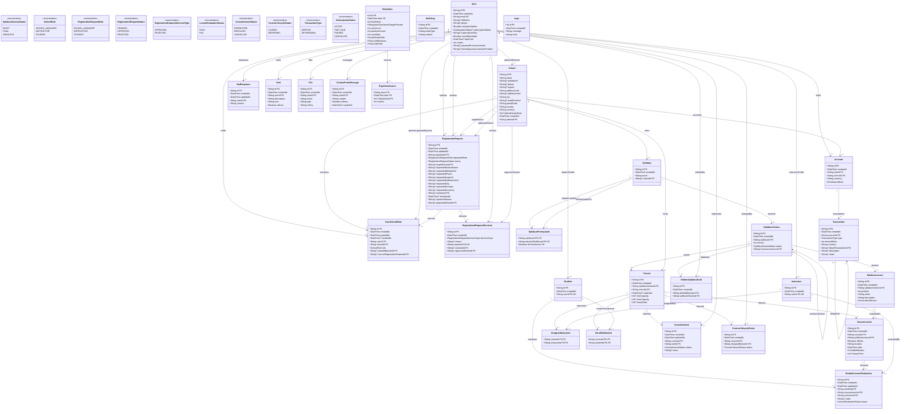

# Database Schema Diagram

```mermaid
classDiagram
    direction TB

    %% ─── Enums ───────────────────────────────────────────────────────────────

    class SyllabusVersionStatus {
        <<enumeration>>
        DRAFT
        FINAL
        OBSOLETE
    }

    class SchoolRole {
        <<enumeration>>
        SCHOOL_MANAGER
        INSTRUCTOR
        STUDENT
    }

    class RegistrationRequestRole {
        <<enumeration>>
        SCHOOL_MANAGER
        INSTRUCTOR
        STUDENT
    }

    class RegistrationRequestStatus {
        <<enumeration>>
        PENDING
        APPROVED
        REJECTED
    }

    class RegistrationRequestDecisionType {
        <<enumeration>>
        APPROVED
        REJECTED
    }

    class LessonEvaluationStatus {
        <<enumeration>>
        PASS
        FAIL
    }

    class CourseInterestStatus {
        <<enumeration>>
        INTERESTED
        ENROLLED
        CANCELLED
    }

    class CourseLifecycleStatus {
        <<enumeration>>
        CLOSED
        REOPENED
    }

    class TransactionType {
        <<enumeration>>
        DEPOSIT
        WITHDRAWAL
    }

    class SubscriptionStatus {
        <<enumeration>>
        ACTIVE
        PAST_DUE
        PAUSED
        CANCELLED
    }

    %% ─── Core Identity ───────────────────────────────────────────────────────

    class User {
        +String id PK
        +DateTime createdAt
        +String email UK
        +String? fullName
        +String? phone
        +Boolean isSystemAdmin
        +SubscriptionStatus? subscriptionStatus
        +String? subscriptionPlan
        +Boolean sendNewsletter
        +DateTime? datePaid
        +Int credits
        +String? paymentProcessorUserId
        +String? lemonSqueezyCustomerPortalUrl
    }

    class School {
        +String id PK
        +String name
        +String? websiteUrl
        +String? phone
        +String? logoUrl
        +String addressLine1
        +String? addressLine2
        +String city
        +String? stateProvince
        +String postalCode
        +String country
        +String currency
        +Int? defaultHourlyRate
        +DateTime createdAt
        +String adminId FK
    }

    %% ─── Role & Membership ───────────────────────────────────────────────────

    class UserSchoolRole {
        +String id PK
        +DateTime createdAt
        +DateTime grantedAt
        +DateTime? revokedAt
        +String userId FK
        +String schoolId FK
        +SchoolRole role
        +String? grantedByUserId FK
        +String? sourceRegistrationRequestId FK
    }

    class RegistrationRequest {
        +String id PK
        +DateTime createdAt
        +DateTime updatedAt
        +String requesterId FK
        +RegistrationRequestRole requestedRole
        +RegistrationRequestStatus status
        +String? targetSchoolId FK
        +String? requestedSchoolName
        +String? requestedWebsiteUrl
        +String? requestedPhone
        +String? requestedLogoUrl
        +String? requestedAddressLine1
        +String? requestedCity
        +String? requestedCountry
        +String? requestedCurrency
        +String? reviewerId FK
        +DateTime? reviewedAt
        +String? rejectionReason
        +String? approvedSchoolId FK
    }

    class RegistrationRequestDecision {
        +String id PK
        +DateTime createdAt
        +RegistrationRequestDecisionType decisionType
        +String? reason
        +String requestId FK,UK
        +String? reviewerId FK
        +String? approvedSchoolId FK
    }

    %% ─── People Profiles ─────────────────────────────────────────────────────

    class Instructor {
        +String id PK
        +DateTime createdAt
        +String userId FK,UK
    }

    class Student {
        +String id PK
        +DateTime createdAt
        +String userId FK,UK
    }

    %% ─── Syllabus & Curriculum ───────────────────────────────────────────────

    class Syllabus {
        +String id PK
        +DateTime createdAt
        +String name
        +String? schoolId FK
    }

    class SyllabusPrerequisite {
        +String syllabusId PK,FK
        +String requiredSyllabusId PK,FK
        +Boolean isForInstructor PK
    }

    class SyllabusVersion {
        +String id PK
        +DateTime createdAt
        +String syllabusId FK
        +Int version
        +SyllabusVersionStatus status
        +String? previousVersionId FK
    }

    class HiddenSyllabusDraft {
        +String id PK
        +DateTime createdAt
        +String deletedByUserId FK
        +String syllabusVersionId FK
    }

    class SyllabusLesson {
        +String id PK
        +DateTime createdAt
        +String syllabusVersionId FK
        +Int position
        +String name
        +String description
        +Int durationMinutes
    }

    %% ─── Course & Delivery ───────────────────────────────────────────────────

    class Course {
        +String id PK
        +DateTime createdAt
        +String syllabusVersionId FK
        +String schoolId FK
        +DateTime? startDate
        +Int? minCapacity
        +Int? maxCapacity
        +Int? hourlyRate
    }

    class CourseLesson {
        +String id PK
        +DateTime createdAt
        +String courseId FK
        +String syllabusLessonId FK
        +Boolean isExtra
        +String location
        +DateTime date
        +Int bufferMinutes
        +Int? lessonPrice
    }

    class AssignedInstructor {
        +String courseId PK,FK
        +String instructorId PK,FK
    }

    class EnrolledStudent {
        +String courseId PK,FK
        +String studentId PK,FK
    }

    class CourseInterest {
        +String id PK
        +DateTime createdAt
        +DateTime updatedAt
        +String courseId FK
        +String userId FK
        +CourseInterestStatus status
        +String? notes
    }

    class CourseLifecycleEvent {
        +String id PK
        +DateTime createdAt
        +String courseId FK
        +String changedByUserId FK
        +CourseLifecycleStatus status
    }

    class StudentLessonEvaluation {
        +String id PK
        +DateTime createdAt
        +DateTime updatedAt
        +String studentId FK
        +String courseLessonId FK
        +String instructorId FK
        +String? notes
        +LessonEvaluationStatus status
    }

    %% ─── Finance ─────────────────────────────────────────────────────────────

    class Account {
        +String id PK
        +DateTime createdAt
        +String userId FK
        +String schoolId FK
        +String currency
        +Int balanceMinor
    }

    class Transaction {
        +String id PK
        +DateTime createdAt
        +String accountId FK
        +TransactionType type
        +Int amountMinor
        +String currency
        +String? linkedTransactionId FK
        +String? description
        +String? notes
    }

    %% ─── Platform / SaaS ─────────────────────────────────────────────────────

    class GptResponse {
        +String id PK
        +DateTime createdAt
        +DateTime updatedAt
        +String userId FK
        +String content
    }

    class Task {
        +String id PK
        +DateTime createdAt
        +String userId FK
        +String description
        +String time
        +Boolean isDone
    }

    class File {
        +String id PK
        +DateTime createdAt
        +String userId FK
        +String name
        +String type
        +String s3Key
    }

    class ContactFormMessage {
        +String id PK
        +DateTime createdAt
        +String userId FK
        +String content
        +Boolean isRead
        +DateTime? repliedAt
    }

    class AuditLog {
        +String id PK
        +DateTime createdAt
        +String entityType
        +String entityId
    }

    class DailyStats {
        +Int id PK
        +DateTime date UK
        +Int totalViews
        +String prevDayViewsChangePercent
        +Int userCount
        +Int paidUserCount
        +Int userDelta
        +Int paidUserDelta
        +Float totalRevenue
        +Float totalProfit
    }

    class PageViewSource {
        +String name PK
        +DateTime date PK
        +Int? dailyStatsId FK
        +Int visitors
    }

    class Logs {
        +Int id PK
        +DateTime createdAt
        +String message
        +String level
    }

    %% ─── Relationships ───────────────────────────────────────────────────────

    %% User ↔ School
    User "1" --> "0..*" School : adminOfSchools
    User "1" --> "0..1" Instructor : instructorProfile
    User "1" --> "0..1" Student : studentProfile

    %% Role / Membership
    User "1" --> "0..*" UserSchoolRole : holds
    School "1" --> "0..*" UserSchoolRole : members
    User "1" --> "0..*" UserSchoolRole : granted (grantedByUser)
    RegistrationRequest "1" --> "0..*" UserSchoolRole : sources

    %% Registration workflow
    User "1" --> "0..*" RegistrationRequest : submits
    User "1" --> "0..*" RegistrationRequest : reviews
    School "1" --> "0..*" RegistrationRequest : targetSchool
    School "1" --> "0..*" RegistrationRequest : approvedSchool
    RegistrationRequest "1" --> "0..1" RegistrationRequestDecision : decision
    User "1" --> "0..*" RegistrationRequestDecision : reviews
    School "1" --> "0..*" RegistrationRequestDecision : approvedSchool

    %% Syllabus chain
    School "1" --> "0..*" Syllabus : owns
    Syllabus "1" --> "0..*" SyllabusVersion : versions
    Syllabus "1" --> "0..*" SyllabusPrerequisite : requires (syllabus)
    Syllabus "1" --> "0..*" SyllabusPrerequisite : isPrerequisiteFor
    SyllabusVersion "1" --> "0..1" SyllabusVersion : previousVersion
    SyllabusVersion "1" --> "0..*" SyllabusLesson : lessons
    SyllabusVersion "1" --> "0..*" HiddenSyllabusDraft : hiddenBy
    User "1" --> "0..*" HiddenSyllabusDraft : deletedBy

    %% Course & delivery
    SyllabusVersion "1" --> "0..*" Course : usedIn
    School "1" --> "0..*" Course : hosts
    Course "1" --> "0..*" CourseLesson : lessons
    SyllabusLesson "1" --> "0..*" CourseLesson : instantiates
    Course "1" --> "0..*" AssignedInstructor : instructors
    Instructor "1" --> "0..*" AssignedInstructor : assignments
    Course "1" --> "0..*" EnrolledStudent : students
    Student "1" --> "0..*" EnrolledStudent : enrollments
    Course "1" --> "0..*" CourseInterest : interests
    User "1" --> "0..*" CourseInterest : expresses
    Course "1" --> "0..*" CourseLifecycleEvent : lifecycle
    User "1" --> "0..*" CourseLifecycleEvent : changedBy

    %% Evaluation
    Student "1" --> "0..*" StudentLessonEvaluation : evaluated
    CourseLesson "1" --> "0..*" StudentLessonEvaluation : inLesson
    Instructor "1" --> "0..*" StudentLessonEvaluation : evaluatedBy

    %% Finance
    User "1" --> "0..*" Account : holds
    School "1" --> "0..*" Account : accounts
    Account "1" --> "0..*" Transaction : transactions
    Transaction "0..1" --> "0..*" Transaction : linkedPair

    %% Platform / SaaS
    User "1" --> "0..*" GptResponse : responses
    User "1" --> "0..*" Task : tasks
    User "1" --> "0..*" File : files
    User "1" --> "0..*" ContactFormMessage : messages
    DailyStats "1" --> "0..*" PageViewSource : sources
```
